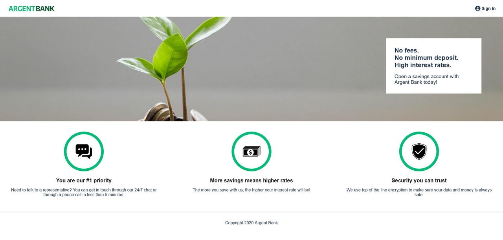

# Argent Bank : Banking application

[](https://reactjs.org/docs/create-a-new-react-app.html) [](https://recharts.org/en-US/)

### Front-End part of the banking application



### Resources:

-  [Designs](https://github.com/OpenClassrooms-Student-Center/Project-10-Bank-API/tree/master/designs)
-  [API Documentation](http://localhost:3001/api-docs) _You must launch the back-end to access this resource_

### Achievement

See the project online: [Demo](https://verapandi.github.io/argent-bank/)

---

# Installation guide

For the project to work properly for you, you need to install and launch the back-end first.

### Prerequisites:

-  [](https://nodejs.org/en/)
-  [MongoDB Community Server](https://www.mongodb.com/try/download/community)

## 1. Install backend and dependencies

Go to this link and clone the back-end: https://github.com/OpenClassrooms-Student-Center/Project-10-Bank-API

Then, install the dependencies.
Open the back-end folder. In the terminal, use the command:

```
npm install
```

## 2. Launch the back-end

In the terminal, start local dev server:

```
npm run dev:server
```

Then, the database:

```
npm run populate-db
```

## 3. Install front-end and dependencies

Clone this repository: https://github.com/VeraPandi/argent-bank

Then, install the dependencies.
Open the front-end folder. In the terminal, use the command:

```
npm install
```

## 4. Launch the front-end

In the terminal, navigate to the back-end folder directory with:

```
cd Project-10-Bank-API-master
```

Start local dev server with:

```
npm run dev:server
```

Then:

```
npm start
```

## Use the app

Once you run the populate-db script, you should have two users in your database:

### Tony Stark

-  First Name: `Tony`
-  Last Name: `Stark`
-  Email: `tony@stark.com`
-  Password: `password123`

### Steve Rogers

-  First Name: `Steve`
-  Last Name: `Rogers`
-  Email: `steve@rogers.com`
-  Password: `password456`

## API Documentation

Once you have started your local environment, you can visit the user API documentation here: http://localhost:3001/api-docs
